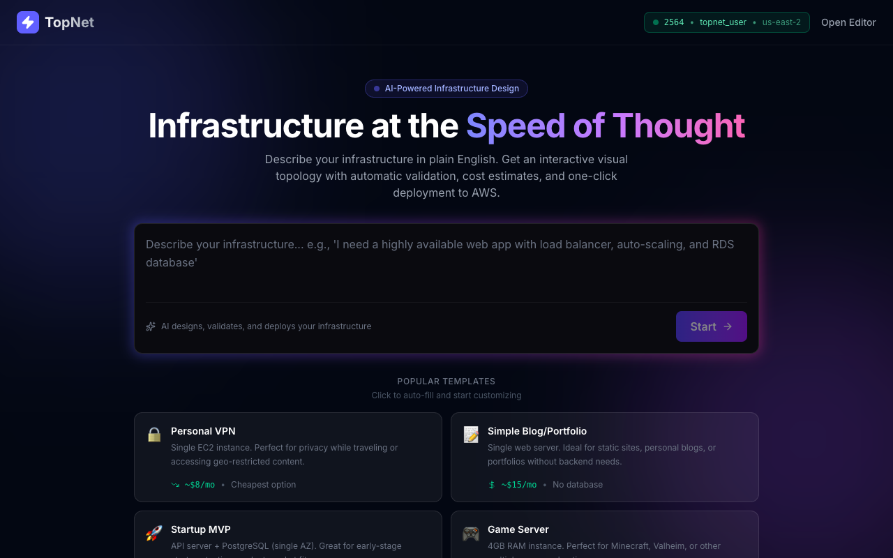

# TopNet - AI Cloud Infrastructure Builder ☁️

**TopNet** is a simple AI-powered tool that lets you design and deploy your own cloud infrastructure just by typing what you want in plain English. No coding or deep technical cloud knowledge required!



## What does it do? 🤔

Imagine you want to start a blog, launch a new app, or host a multiplayer game server. Usually, you'd need to learn complicated cloud systems and networking rules. With TopNet, it's as easy as chatting:

1. **You describe what you want:** "I need a WordPress blog with a database," or "Set up a Minecraft server."
2. **TopNet draws it for you:** It instantly generates a clean visual map of your required servers and databases.
3. **It double-checks everything:** TopNet automatically ensures your setup is secure and shows you estimated monthly costs.
4. **Deploy with one click:** Once you're happy with the diagram, TopNet magically sets it all up for you in the real world (using AWS)!

## What can I build with it? 🌍

- 📝 **WordPress / Blogs** - Easily set up a robust website to share your content.
- 🚀 **Web Apps** - Get the backend for your new startup running smoothly.
- 🎮 **Game Servers** - Host a Minecraft or Valheim game dedicated for you and your friends.
- 🔒 **Personal VPNs** - Set up a quick, secure connection for safe web browsing anywhere.

## How to try it yourself 🚀

To get TopNet running on your own computer:

### Prerequisites
- Python 3.10+
- Node.js 18+
- Terraform (If you want to actually deploy your creations)

### Install and Start

Just open up your terminal and run these commands:

```bash
git clone https://github.com/yousefmaher/TopNet.git
cd TopNet
./start.sh
```

Once it's running, open your web browser and visit **http://localhost:5173** to start building!
